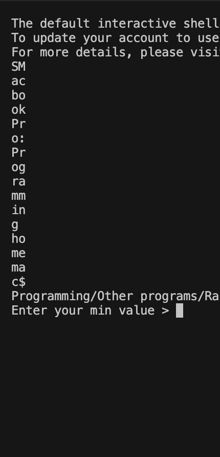
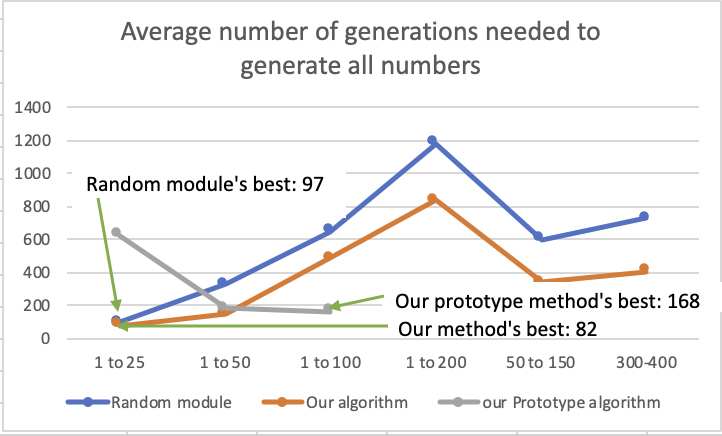
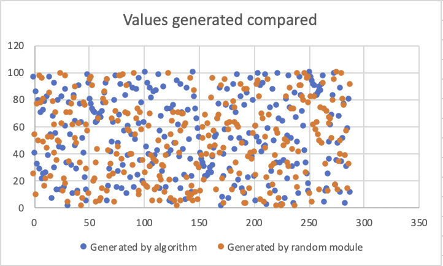
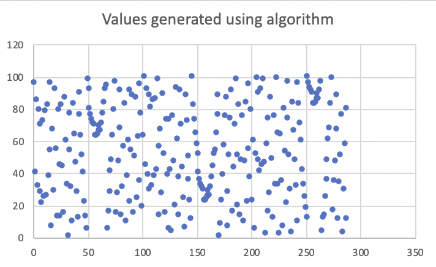
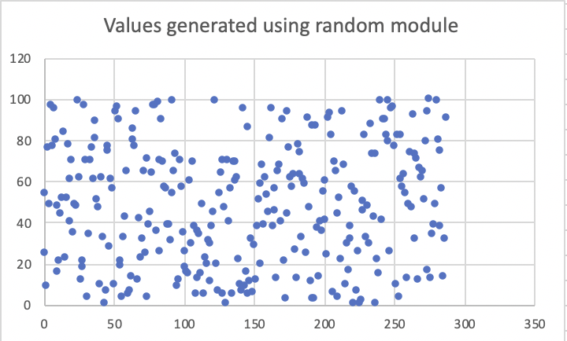
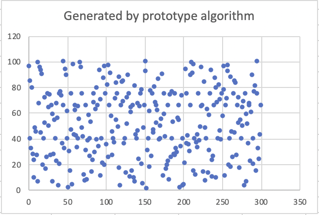
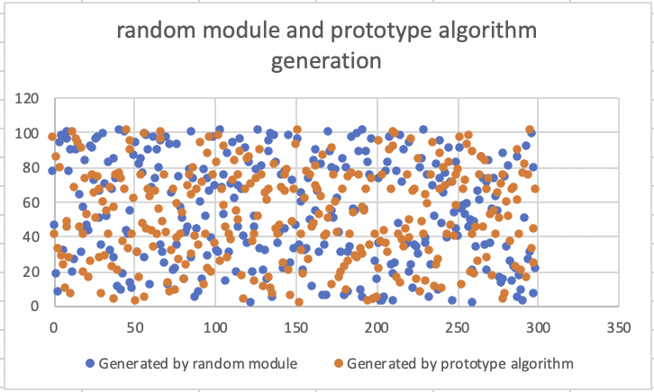

# randomizing-algorithm
- I've heard that the way computers generate random numbers is not really random, but algorithm based.

- This algorithm does generate varying numbers, but some are repeated more than others

- Works better for larger number ranges, for small ranges not all numbers are generated

- **Important: This algorithm IS predictable and not meant for actual use. It will generate varying numbers that may appear to be random, but the are predictable.**

- Also, I'm working on a prototype algorithm that will randomize the list using the same algorithm rather than shuffling it

- Open a pull request or issue if you spot any problems

# how it works

- Makes a list of all the integers in the given range
- Shuffles the list a few times by pushing all the numbers down by 1. The last number is moved to the start. Every 5 number generations, the program will push the list a few times.
- Picks an algorithm determined number from the list

 

# Stats

## Generations taken for full coverage

- As shown, the both our algorithm's and our prototype algorithm's coverage times are quite comparable to the random module's

## Values generated compared

- Like those generated by the random module, the numbers generated are scattered

## Values generated by algorithm
 
 
- Though the values are mostly scattered, some things should be noted
  - All values will eventually appear, since the list is being shuffled, but some will appear more than others
  - Distinct parabolic shapes can be observed left-top, middle-top, and middle-right.

## Values generated by Random module
 
 
- Unlike our algorithm's generations, no significant and reeating pattern can be observed in the random module's generations
 
# Testing 
 - Testing is undergoing to figure out the most efficient number of shuffles per cycle. See a clip below.

 .gif)
 
 # Prototype algorithm
 - Our Prototype algorithm randomizes the list using the same random picking algorithm rather than shuffling it.
 - Is less predictable than original algorithm and has few observable patterns.
 - It should be noted that prototype algorithm is much slower because when it randomizes it has to do a full scan, search, and list append.
 
 
 

