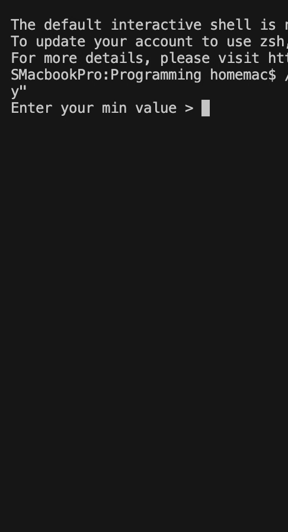
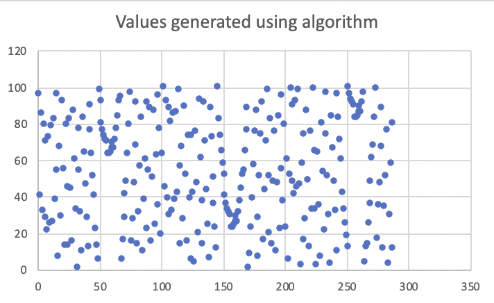
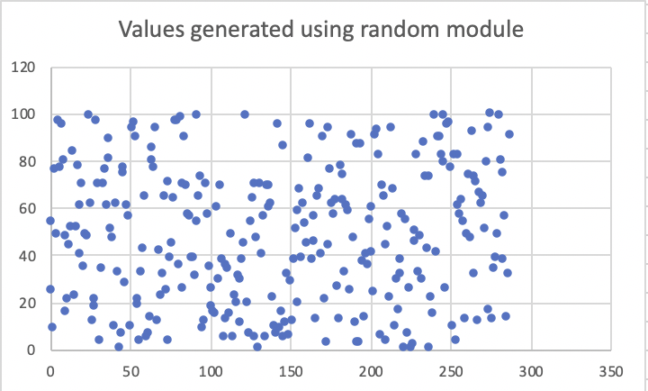
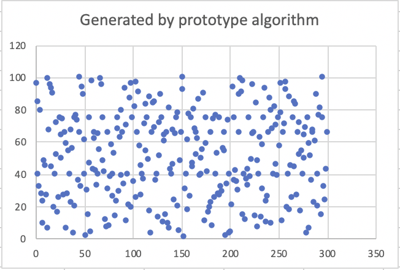
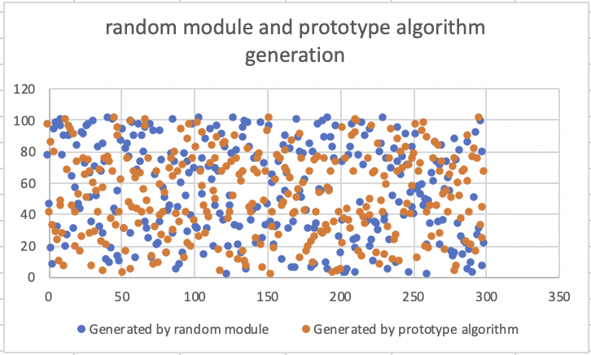

# randomizing-algorithm
- I've heard that the way computers generate random numbers is not really random, but algorithm based.

- This algorithm does generate varying numbers, but some are repeated more than others

- works better for larger number ranges, for small ranges variation is little

- **Important: This algorithm IS predictable and not meant for actual use. It will generate varying numbers that may appear to be random, but the are predictable.**

- Also, I'm working on a prototype algorithm that will randomize the list using the same algorithm rather than shuffling it

- Open a pull request or issue if you spot any problems

# how it works

- makes a list of all the integers in the given range
- shuffles the list twice using the randomize list algorithm
  - originally, it would shuffle the list using the picking algorithm, but then i found out that the picking algorithm excludes some numbers and repeates other
  - Now there is another algorithm that I added which shuffles this list by pushing all the numbers down by 1. the last number is moved to the start. every 5 number generations, the program will push the list a few times.
- picks an algorithm decided number from the list

 

# Stats

## Generations taken for full coverage

## Values generated compared

- Like those generated by the random module, the numbers generated are scattered

## Values generated by algorithm
 
 
- Though the values are scattered, some things can be noted
  - All values will eventually appear, since the list is being shuffled, but some will appear more than others
  - there are some clusters in the left-top, middle-top, and middle-right

## Values generated by Random module
 
 
# Testing 
 - Testing is undergoing to figure out the most efficient number of shuffles per cycle. See a clip below.

 .gif)
 
 # Prototype algorithm
 - randomizes the list using the same random picking algorithm rather than shuffling it
 - Is less predictable than original algorithm
 - should be noted though that prototype algorithm is much slower because when it randomizes it has to do a full scan and search
 
 

